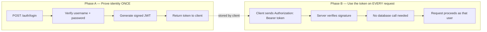
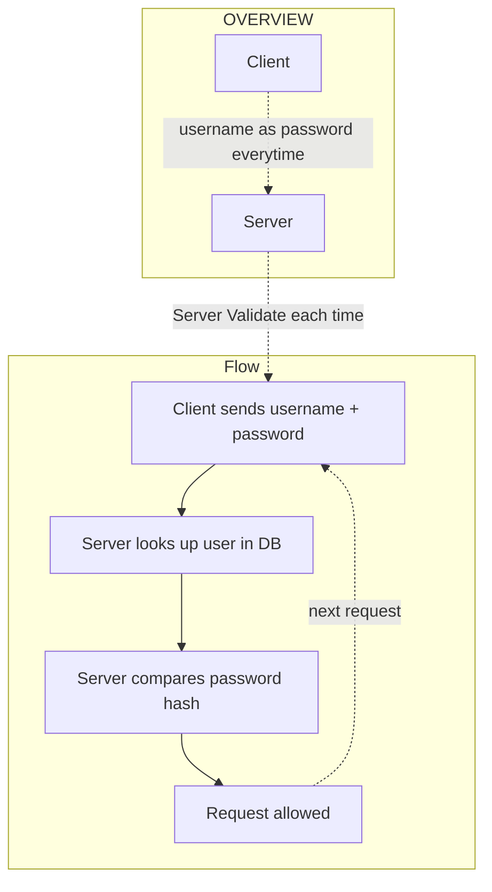
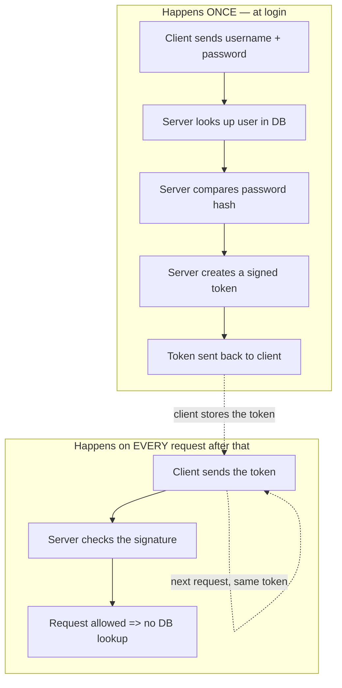
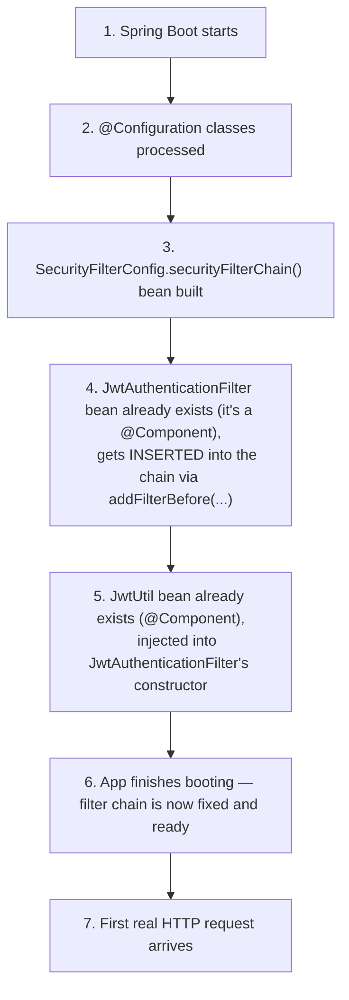
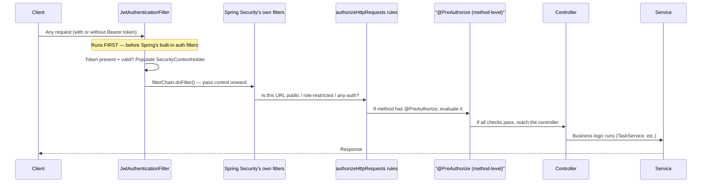
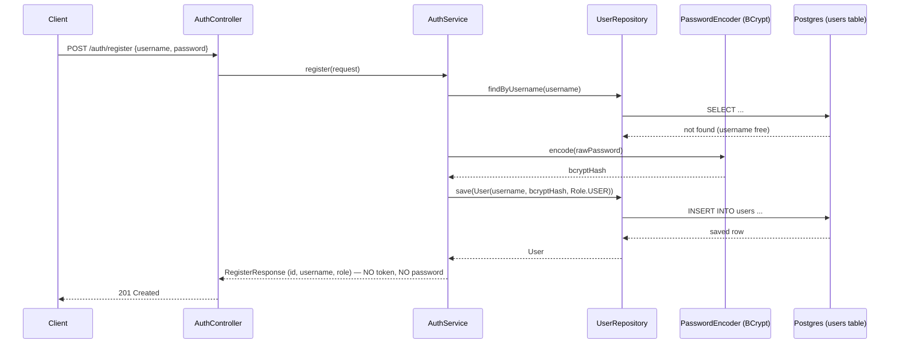
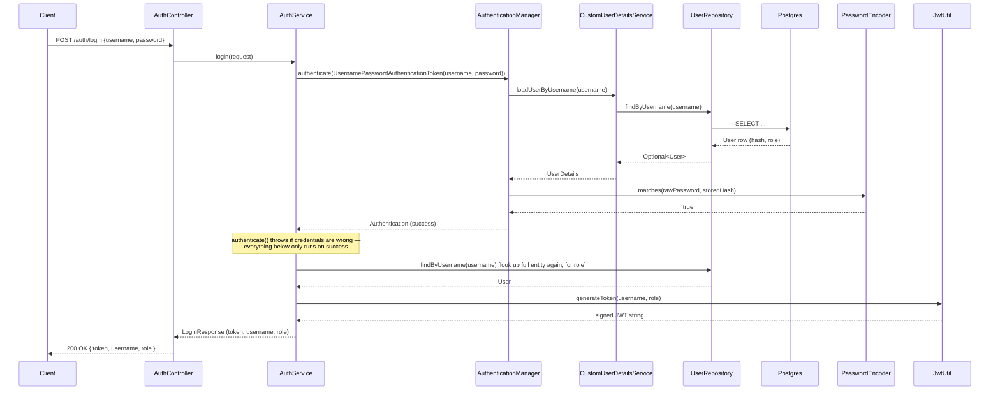
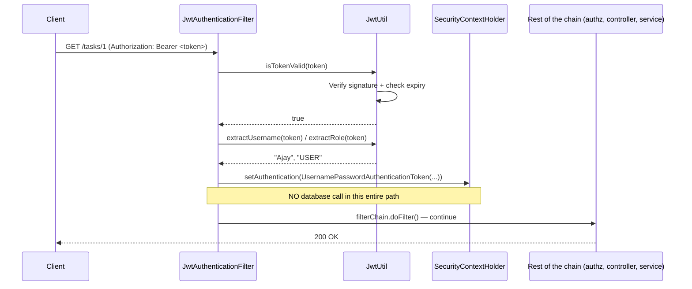

# JWT Authentication — How It Works
### Phase 9 — `phase-9-jwt-auth`

---

# 1. How JWT-Based Authentication Works

## What a JWT actually is

A JWT (JSON Web Token) is a string made of **three base64-encoded parts**,
separated by dots:

```
eyJhbGciOiJIUzUxMiJ9 . eyJzdWIiOiJBamF5Iiwicm9sZSI6IlVTRVIi... . lsHVQ6b_tJN0smjJy6cUzL...
     HEADER                      PAYLOAD (claims)                    SIGNATURE
```

- **Header** — which signing algorithm was used (e.g. `HS512`)
- **Payload (claims)** — the actual data: `sub` (username), `role`,
  `iat` (issued-at), `exp` (expiry)
- **Signature** — a cryptographic hash of `header + payload`, computed
  using a **secret key only the server knows**

The header and payload are just base64 — **readable by anyone**, not
encrypted. The security guarantee is entirely in the **signature**: if
anyone changes even one character of the payload (e.g. `"role":"USER"` →
`"role":"ADMIN"`), the signature no longer matches, and the server rejects
the token the moment it tries to verify it.

## The two-phase lifecycle



This is the fundamental shift from Basic Auth: instead of sending your
**raw password** on every single request, you send it **once**, get back
a token, and that token — not your password — proves who you are from
then on. A stolen token is only valid until it expires; a stolen password
is valid forever until manually changed.

---
# Why JWT? — In Simple Words

## The old way (Basic Auth)

Every single request had to do all of this, again and again:



Even if you called `GET /tasks/1` ten times in a row, the server repeated
the **entire** process ten times:
1. Read username + password from the request
2. Query the database for that user
3. Compare the password hash
4. Only then allow the request through

That's a lot of repeated work for something that doesn't actually change
between requests — you're still the same person you were 5 seconds ago.

---

## The new way (JWT)

The heavy work happens **once**, at login. After that, the server just
checks a signature — no database involved.



---

## Side-by-side comparison

| Step | Basic Auth | JWT |
|---|---|---|
| Send username + password | Every request | **Once**, at login only |
| Look up user in the database | Every request | **Once**, at login only |
| Compare password hash | Every request | **Once**, at login only |
| What proves who you are, after login | The password, sent again each time | The token, sent each time instead |
| How the server checks that proof | Database query + hash comparison | Just checks the token's signature (fast, no database) |

---

## In one sentence

> Instead of sending your username and password and hitting the database
> on **every single request**, you do that just **once** at login, get a
> token back, and every request after that just proves you already logged
> in — by showing the token — without the server ever touching the
> database again to check it.

---

## Why this matters

- **Faster** — checking a signature is quick math; querying a database
  every time is slower, especially under heavy traffic.
- **Less database load** — with many users making many requests, Basic
  Auth means constant database hits just for identity checks. JWT removes
  almost all of that.
- **Smaller risk if something leaks** — a stolen password works forever
  until manually changed. A stolen token only works until it expires
  (see Phase 10 — refresh tokens build on this idea further).
# 2. Initialization Order — What Sets Up First

This is the part that's easy to get backwards when reading the code
top-down, so here's the actual sequence, in the order Spring really
does it:



**The key thing to understand:** `JwtAuthenticationFilter` and `JwtUtil`
are built as Spring beans **before** `SecurityFilterChain` even runs —
they exist independently. `SecurityFilterChain`'s job isn't to *create*
the JWT filter, it's to **register an already-existing filter at a
specific position** in the request-processing pipeline, via:

```
.addFilterBefore(jwtAuthenticationFilter, UsernamePasswordAuthenticationFilter.class)
```

So the boot-time order is: **beans first (`JwtUtil`, `JwtAuthenticationFilter`,
`CustomUserDetailsService`, etc.) → then the filter chain wires them
together into a pipeline → then the app is ready to receive requests.**

## What happens on every single incoming request (runtime order)

Once the app is running, this is the order a request actually passes
through:



**Why `JwtAuthenticationFilter` has to run before Spring's own filters:**
`authorizeHttpRequests` and `@PreAuthorize` never look at the raw
`Authorization` header themselves — they only ever check
`SecurityContextHolder`. If `JwtAuthenticationFilter` ran *after* those
checks, the context would still be empty when the checks fire, and every
request would look unauthenticated regardless of a valid token being
present. `addFilterBefore(..., UsernamePasswordAuthenticationFilter.class)`
guarantees the token is processed and the context populated *before*
anything downstream tries to read it.

---

# 3. Login and Register Flows (separate, end to end)

## Register flow — creating a new account



**Note:** registering does **not** log you in or issue a token. It only
creates the account. Role is always hardcoded to `USER` — never accepted
from the client.

## Login flow — exchanging credentials for a token



**Important distinction from register:** login reuses the **exact same**
credential-checking path (`AuthenticationManager` →
`CustomUserDetailsService` → `PasswordEncoder`) that Basic Auth used to
trigger automatically via a filter — here we just call it manually,
inside our own endpoint, and use success as the trigger to mint a token.

## Using the token — every request after login



**The real payoff, made concrete:** compare this to Basic Auth, which hit
`UserDetailsService` → a real SQL query → on **every single request**.
This filter validates a signature (pure computation, no I/O) instead —
that's the actual scalability difference between the two mechanisms,
not just a theoretical claim.

---

## Quick reference — what's checked, and where

| Question | Checked by | When |
|---|---|---|
| Is this token genuine / not tampered with? | `JwtUtil.isTokenValid()` | Every request, in the filter |
| Is this URL public, role-restricted, or any-auth? | `authorizeHttpRequests` | Every request, after the filter |
| Can this specific user touch this specific data? | `@PreAuthorize` + `TaskSecurity.isOwner()` | Only on annotated service methods |
| Are the original username/password correct? | `AuthenticationManager` + `PasswordEncoder` | Only once, at `/auth/login` |


---
