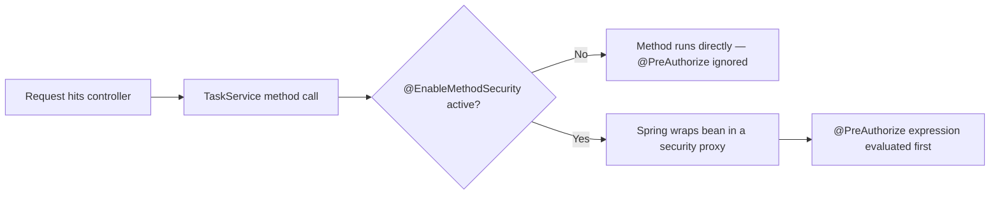
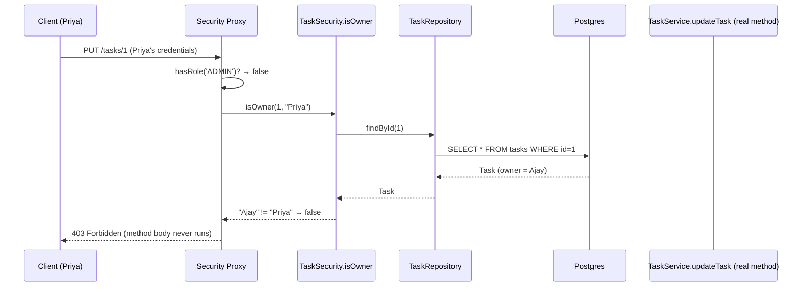
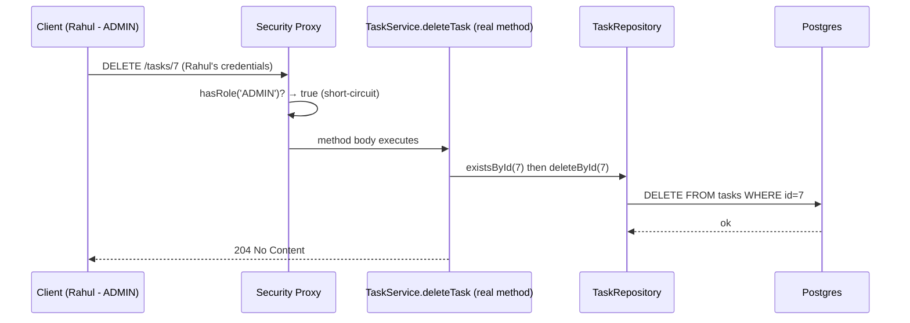
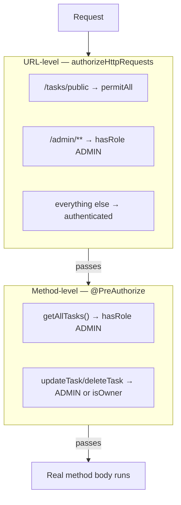

# Phase 6 — Method-Level Security (Ownership Checks)
### Branch: `phase-6-method-security`

This phase turned the `owner` field (added in Phase 5, but never enforced)
into an actual security boundary — a USER can only update/delete their own
tasks, while ADMIN can override and touch anyone's.

---

## Step 1 — Enable method security

**What we built:** Added `@EnableMethodSecurity` on `SecurityFilterConfig`.

**Why:** `@PreAuthorize` annotations are silently ignored without this — no
error, no warning, they just never run. One line, but easy to forget.

---

## Step 2 — Admin-only method rule

**What we built:** `@PreAuthorize("hasRole('ADMIN')")` on `TaskService.getAllTasks()`.

**Why:** The existing URL rule (`/admin/**` → `hasRole('ADMIN')`) only
protects that one path. If `getAllTasks()` were ever called from another
controller or internal code path later, the URL rule wouldn't apply —
method-level security closes that gap by protecting the *method itself*,
regardless of how it's reached.

**Note:** Deliberately redundant with the Phase 4 URL rule — this is
defense in depth, not duplication for its own sake.

---

## Step 3 — Ownership rule on update/delete

**What we built:**
- `@PreAuthorize("hasRole('ADMIN') or @taskSecurity.isOwner(#id, authentication.name)")`
  on both `updateTask(id, ...)` and `deleteTask(id)`
- New `TaskSecurity` bean (`@Component("taskSecurity")`) with an
  `isOwner(taskId, username)` helper method

**Why:** Role checks alone (Phase 4) never distinguished *whose* task it
is. Without this, any logged-in USER could edit or delete *any* task —
Phase 5 stored the owner, but nothing was checking it until now.

**Why a separate `TaskSecurity` bean:** SpEL can call simple method chains,
but "fetch the task, then compare a nested field" isn't cleanly expressible
inline. The standard pattern is a small helper bean referenced from the
annotation via `@beanName.method(...)`.

**Important caveat documented:** for a non-owner/non-admin caller, a
task that doesn't exist and a task that belongs to someone else both
return `403` — the ownership check runs *before* the method body's own
`findById`/`TaskNotFoundException` logic, so it can't distinguish
"doesn't exist" from "not yours." Only the owner or an ADMIN can ever
reach the real `404` path on update/delete. This is a deliberate,
defensible tradeoff (avoids leaking which IDs exist), not a bug.

---

## Step 4 — Verify cross-user access is blocked

**What we tested:**

| Test | Caller | Target | Expected |
|---|---|---|---|
| Update someone else's task | Priya | Ajay's task | `403` |
| Delete someone else's task | Priya | Ajay's task | `403` |
| Reverse direction | Ajay | Priya's task | `403` |
| Confirm no silent write | Ajay (GET) | own task | title unchanged |
| Admin override — update | Rahul | Ajay's task | `200` |
| Admin override — delete | Rahul | Priya's task | `204` |

All confirmed working — ownership is now enforced both ways, and the
ADMIN override path works cleanly on top of it.

---

## Two layers of authorization, side by side

URL rules gate *which endpoints* are reachable at all. Method rules gate
*which specific data* a given method call is allowed to touch — something
a URL pattern alone can never express (`/tasks/{id}` can't know in advance
whether `{id}` belongs to the caller).

---

## What's still open / deferred to later phases

- Auth failures (`401`/`403`) still return Spring's default bodies, not a
  consistent custom JSON shape — that's **Phase 7**.
- Still using Basic Auth + stateless-by-nature credentials — **Phase 8**
  examines why this doesn't scale, setting up **Phase 9**'s move to JWT.
